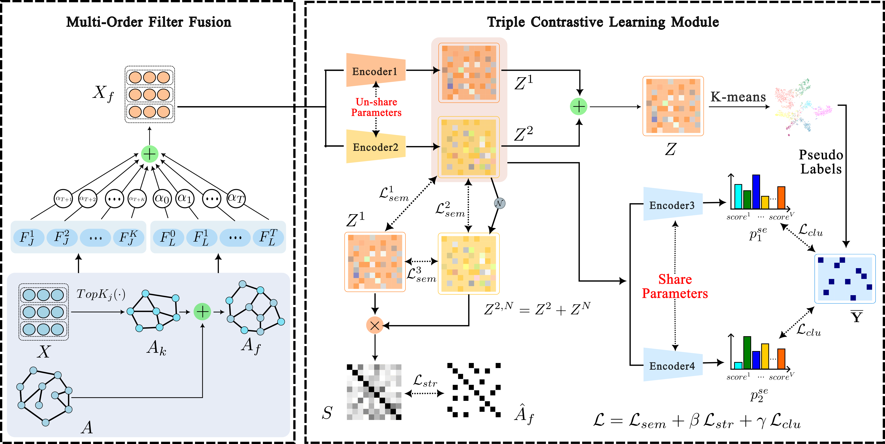

# Multi-order Filtering Fusion and Triple Contrastive Learning for Attribute Graph Clustering(MT-AGC)

This repository provides an **anonymous** implementation for the paper:

**“Multi-Order Feature Fusion and Pseudo-Label Guided Semantic Matching for Contrastive Graph Clustering”**

> For questions, please open an issue in this repository.

---
## Overview

We propose **MT-AGC**, a feature-enhanced contrastive graph clustering framework with reliable pseudo-supervised feedback.  
The overall framework consists of:

- **Multi-order Filter Fusion (MFF)**: attribute-similarity-induced global graph construction + fusion with original topology; multi-order low-pass filtering; self-attentive order fusion to obtain multi-scale structural–semantic representations.
    
- **Triple Contrastive Learning (TCL)**: joint optimization of structural contrast, semantic contrast, and clustering-aware (pseudo-label guided) semantic matching with a **two-stage** pseudo-label strategy.
<p align="center">
  
</p>

<p align="center">
  <em>
    Figure 1. The overall framework of MT-AGC consists of two main modules: (1) the Multi-order Filter Fusion (MFF) module, which produces a comprehensive node representation X_f; and (2) the Triple-contrastive Learning (TCL) module, which refines the embeddings via structural, semantic, and clustering contrastive objectives. The final clustering results are obtained by performing <i>K</i>-means on the refined node embeddings.
  </em>
</p>


---

## Quick Start

### Step 1: Prepare datasets

Unzip the dataset files into the `./dataset` folder.

### Step 2: Run training

```bash
python train.py --dataset cora
python train.py --dataset citeseer
```